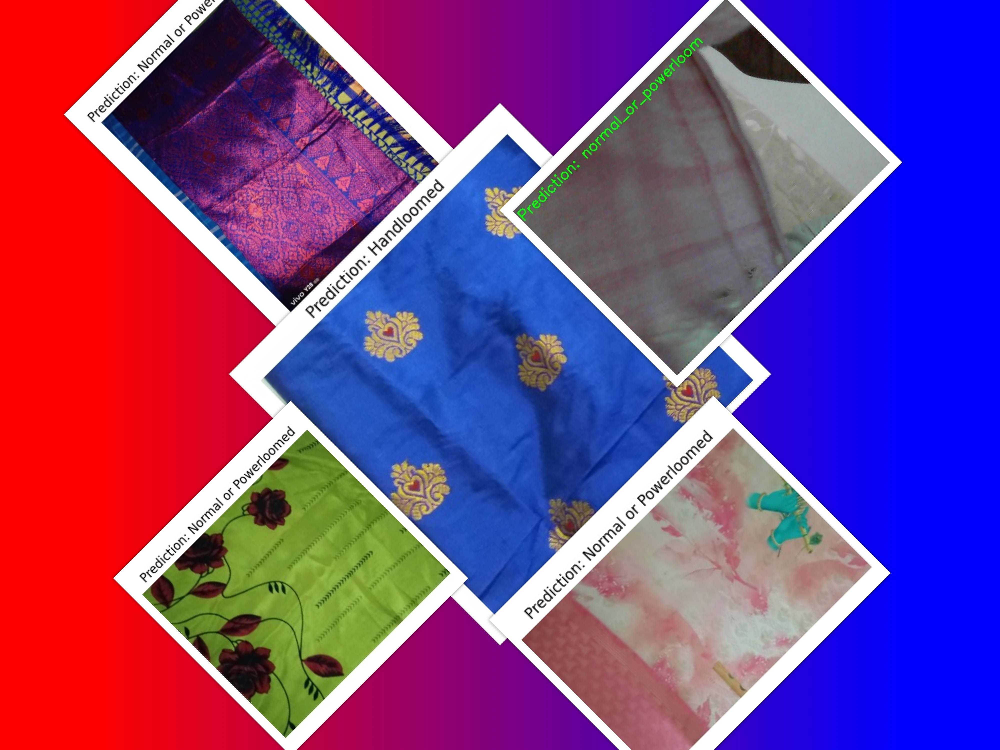

# Cloth Classification with TensorFlow Lite

## Overview

This project classifies cloth types into 'handloom' or 'normal_or_powerloom' using a Convolutional Neural Network (CNN) model trained with TensorFlow and converted to TensorFlow Lite for efficient inference. The application captures images using a webcam, processes them, and predicts the cloth type in real-time.

## Project Structure

- `model_training.py`: Script to train and save the TensorFlow model.
- `predict.py`: Script to run inference using the TensorFlow Lite model.
- `cloth_classifier_model.h5`: Trained Keras model (saved model file).
- `cloth_classifier_model.tflite`: TensorFlow Lite model (converted model file).


## Prerequisites

1. **Python**: Ensure Python 3.x is installed.
2. **Required Libraries**: Install the required Python libraries:

    ```bash
    pip install tensorflow tflite-runtime opencv-python
    ```

3. **Dataset**: Prepare your dataset and organize it into the following directory structure:
    ```
    dataset/
    ├── train/
    │   ├── handloom/
    │   └── normal_or_powerloom/
    ├── validation/
    │   ├── handloom/
    │   └── normal_or_powerloom/
    └── test/
        ├── handloom/
        └── normal_or_powerloom/
    ```

## How to Use

### 1. Training the Model

Run the `model_training.py` script to train the CNN model and save it. This script will also generate accuracy and loss plots.

```bash
python model_training.py
```

- **Training**: The script will train the model and save it as `cloth_classifier_model.h5`.
- **Plots**: Accuracy and loss plots will be saved as `accuracy_plot.png` and `loss_plot.png`, respectively.

### 2. Converting the Model to TensorFlow Lite

Convert the Keras model to TensorFlow Lite format:

```python
import tensorflow as tf

# Load the trained Keras model
model = tf.keras.models.load_model('cloth_classifier_model.h5')

# Convert the model to TensorFlow Lite format
converter = tf.lite.TFLiteConverter.from_keras_model(model)
tflite_model = converter.convert()

# Save the TensorFlow Lite model
with open('cloth_classifier_model.tflite', 'wb') as f:
    f.write(tflite_model)
```

### 3. Running the Prediction Script

Ensure your webcam is connected and the TensorFlow Lite model (`cloth_classifier_model.tflite`) is in the same directory as the `predict.py` script.

Run the `predict.py` script to start real-time classification:

```bash
python predict.py
```

- **Display**: The script will open a window showing the live feed from the webcam with predictions overlaid.
- **Exit**: Press 'q' to exit the script.

## Adding and Displaying Accuracy and Prediction Images

### Accuracy Plot

To add the accuracy plot to your project:

1. **Generate Plots**: Ensure `model_training.py` generates the `modelacuuracy.png`
2. **Upload Plots**: Upload these plot images to your project repository.
3. **Include in README**: Reference these images in your README for visual performance evaluation.

## Prediction Examples

Here are some example predictions:




## Troubleshooting

- **Camera Issues**: Ensure the webcam is properly connected and accessible.
- **Model Errors**: Verify the TensorFlow Lite model path is correct.
- **Library Errors**: Check that all required libraries are installed and updated.

## License

This project is licensed under the MIT License. See the [LICENSE](LICENSE) file for details.

## Acknowledgements

- TensorFlow: [tensorflow.org](https://www.tensorflow.org/)
- OpenCV: [opencv.org](https://opencv.org/)

## Contact

For any questions or issues, please contact [your-email@example.com](mailto:your-vishnuprasanth.a.agri44@gmail.com).

---

Feel free to adjust any sections according to your project's specifics and any additional details you may want to include.
